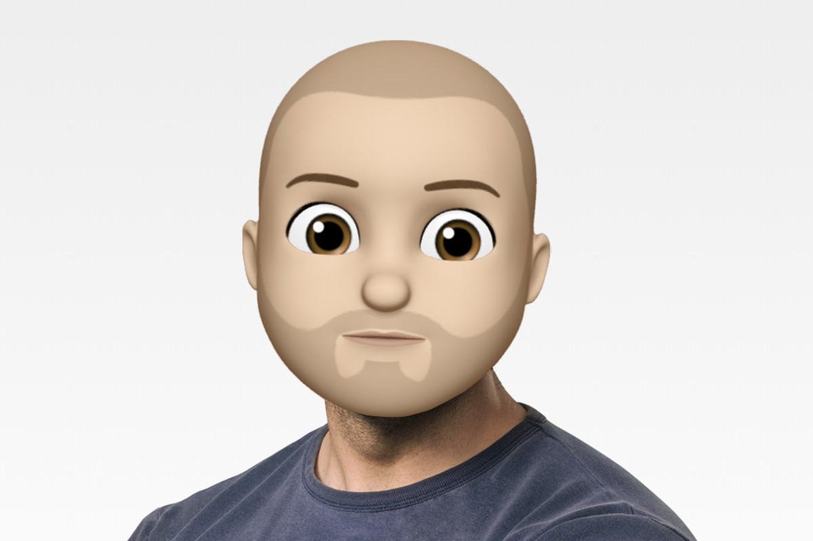

# Cornershop iOS Development Test

### Before you begin
You will need to create a private GitHub repository using the information that we provided in this README. When you finish your test, our team will provide through email the corresponding GitHub accounts to share your app.

Should you have any questions (UI design, deadlines, etc), please reach to the recruiter.

Please read this whole readme file. It's very important that you follow the instructions properly. That being said, we like surprises.

## The Test
Create an iOS app for counting things. You'll need to meet high expectations for quality and functionality.

It must meet at least the following topics:

* **States are crucial**. You must handle each state transition properly.
* Add a named counter to a list of counters.
* Increment any of the counters.
* Decrement any of the counters.
* Delete a counter.
* Show a sum of all the counter values.
* Search counters.
* Enable sharing counters.
* Handle batch deletion.
* Unreliable networks are a thing. State management and error handling is **important**.
* Persist data *locally* and back to the server.
   * The app should persist the counter list if the network is not available (i.e Airplane Mode).
* It must **not** feel like a learning exercise. Think you’re building this for the App Store.
* Don't build anything that doesn't feel right for iOS (**no** Material Design, for example).

### UI Mocks
Build the app using [this Figma spec](https://www.figma.com/file/PyfLvIWQss7Ki9lmzeoY9a/Counters-for-iOS).

### Other Important Notes

* If you're using a dependency manager (like `CocoaPods` or `Carthage`) or the project requires additional configurations before compiling the app, **please** add a proper `README`.
* You can use the latest Swift version and the latest beta of Xcode.
* `SwiftUI` is not welcomed yet, please avoid using it.
* Showing off the capabilities of `UIKit` and `Core` frameworks is **essential**.
* If you're not implementing a particular functionality, don't add/enable it in the project.

**Remember**:
- The UI is super important. It should be neat and tidy. If you have any doubts, please reach to the team so we can clarify whatever is unspecified.
- We look at your deliverable in a _holistic_ way: delivering 60% of the test doesn't translate to a B or C grade: it's an F (or a [super F](SuperF.png)).
- If you need additional time to properly finish the test, please don't hesitate to ask for more. There's no penalty in asking for more time; there's penalty for not delivering quality software. We're looking forward to reviewing your best code ever, not a rushed implementation. Seriously just ask!

### Bonus Points (not mandatory, but nice):

* Don't use any external dependencies.
* Don't use libraries such as `ReactiveCocoa`, `RxSwift` or `Combine` (really, any reactive programming library in general).
* Lightweight view controllers (view-code would be awesome 🚀).
* Showing off some `Core Animation` knowledge.
* `XCTest`s are good.
* Think that this project could be developed alongside multiple developers. `GitFlow` usage would be useful.
* This app could also be used on landscape and/or iPad devices (i.e 2/3 Split View).
* Other cool stuff! We like to be surprised 🙂

## The Server

Run the mock server (included in this repo) by executing:

```
$ npm install
$ npm start
```

## API Endpoints and Examples

The following endpoints are expecting `Content-Type: application/json`:

- `GET` `/api/v1/counters`

   Response Body:
   ```
   [
   ]
   ```

- `POST` `/api/v1/counter`

   Request Body:
   ```
   {
      "title": "Coffee"
   }
   ```
   Response Body:
   ```
   [
      {
         "id": "foo",
         "title": "Coffee",
         "count": 0
      }
   ]
   ```

- `POST` `/api/v1/counter`

   Request Body:
   ```
   {
      "title": "Tea"
   }
   ```
   Response Body:
   ```
   [
     { 
        "id": "asdf",
        "title": "Coffee",
        "count": 0
     },
     {
        "id": "qwer",
        "title": "Tea",
        "count": 0
     }
   ]
   ```

- `POST` `/api/v1/counter/inc`

   Request Body:
   ```
   {
      "id": "asdf"
   }
   ```

   Response Body:
   ```
   [
      {
         "id": "asdf",
         "title": "Coffee",
         "count": 1
      },
      {
         "id": "qwer",
         "title": "Tea",
         "count": 0
      }
   ]
   ```

- `POST` `/api/v1/counter/dec`

   Request Body:
   ```
   {
      "id": "qwer"
   }
   ```
   Response Body:
   ```
   [
      {
         "id": "asdf",
         "title": "Coffee",
         "count": 1
      },
      {
         "id": "qwer",
         "title": "Tea",
         "count": -1
      }
   ]
   ```

- `DELETE` `/api/v1/counter`

   Request Body:
   ```
   {
      "id": "qwer"
   }
   ```
   Response Body:
   ```
   [
      {
        "id": "asdf",
        "title": "Coffee",
        "count": 1
      }
   ]
   ```

- `GET` `/api/v1/counters`

   Response Body:
   ```
   [
      {
         "id": "asdf",
         "title": "Coffee",
         "count": 1
      }
   ]
   ```

---



_"Design it to look like my sh*t." -J_